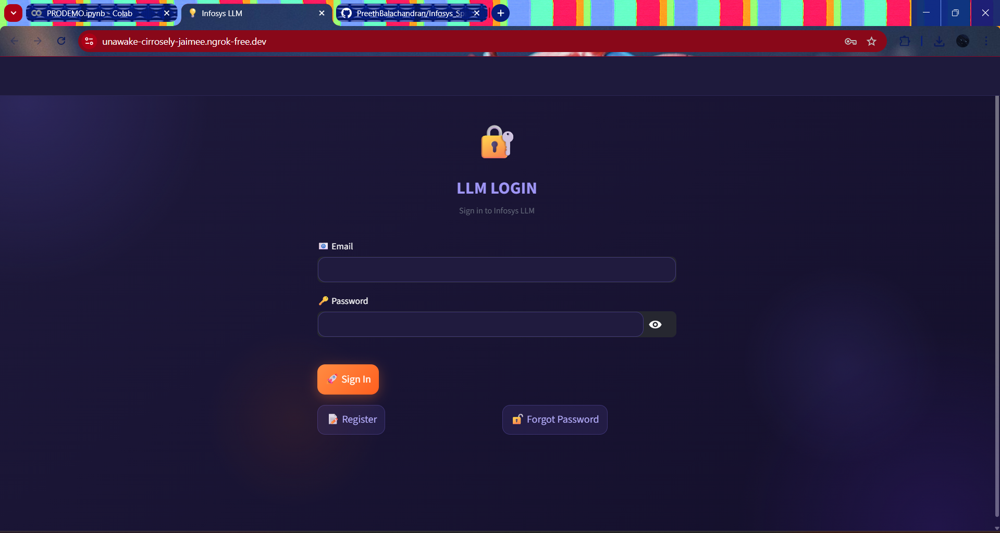
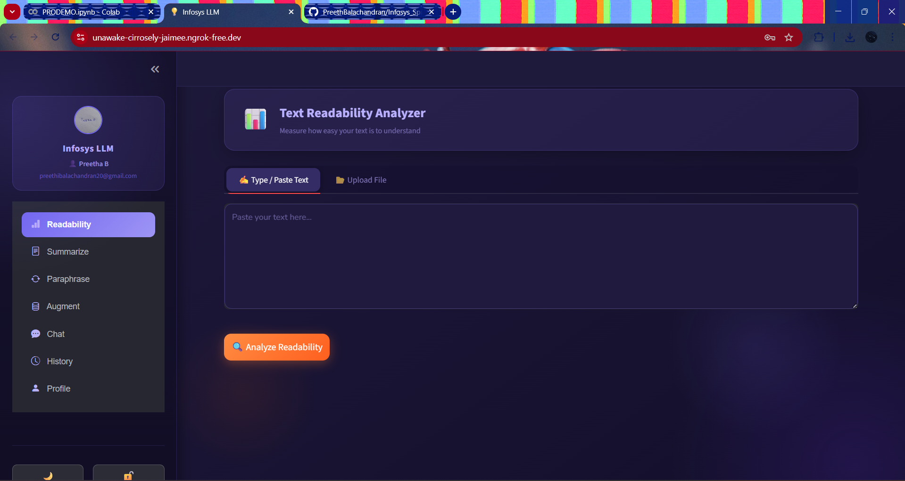
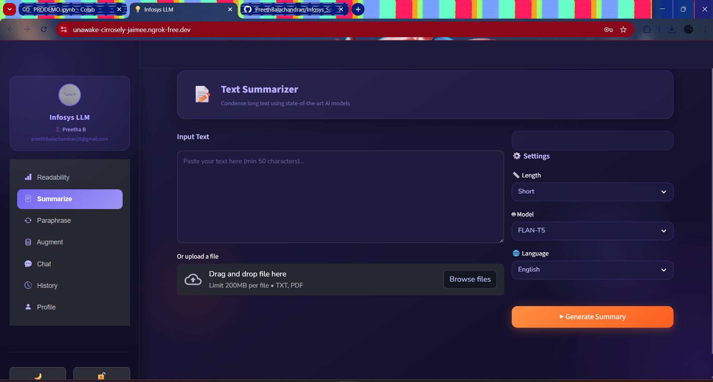
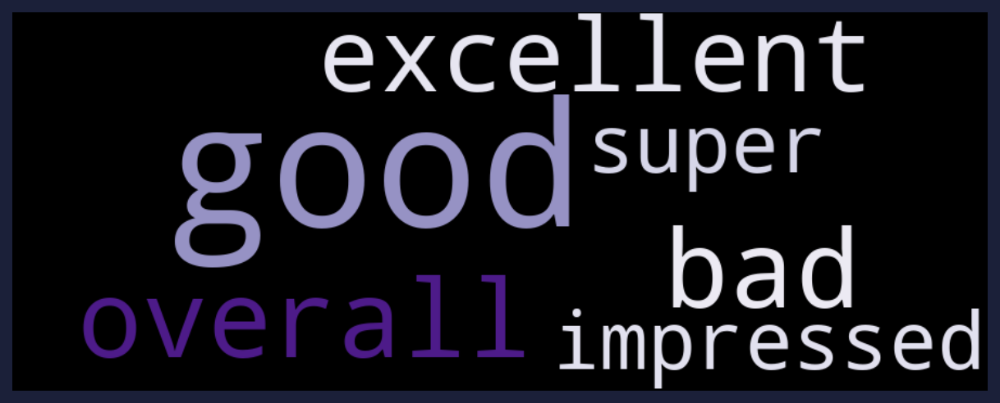

# Infosys_Springboard_TextMorph_Advanced_Text_Summarization_and_Paraphrasing

---

# 🧠 TextMorph

AI-Powered Content Simplification, Summarization & Paraphrasing Suite

🚀 Transforming complex content into clear, concise, and accessible communication using advanced Artificial Intelligence.

🔍 Designed to bridge the gap between complex information and user understanding by leveraging powerful NLP models, real-time analytics, and a secure, user-friendly interface.

---

## 🔗 Quick Links

| Category          | Link                |
| ----------------- | ------------------- |
| 📽️ Demo Video    | Yes                 |
| 🧩 Source Code    | This Repository     |
| 🐳 Docker Support | Yes                 |
| 🧠 AI Models      | BART · PEGASUS · T5 |

---

## 📌 Table of Contents

* About the Project
* Problem Statement & Motivation
* Key Features
* Architecture
* Tech Stack
* Models Used
* Project Structure
* Installation & Setup
* Usage Guide
* Admin Controls
* Datasets & Evaluation
* Screenshots
* Roadmap
* Team
* License

---

## 📖 About the Project

TextMorph is a comprehensive AI-driven text intelligence platform designed to bridge the gap between complex information and user understanding.

In today’s digital world, users frequently encounter:

* lengthy documents
* complex academic content
* technical articles
* dense reports

👉 TextMorph solves this problem using advanced NLP models to:

* simplify difficult text
* generate concise summaries
* paraphrase content intelligently
* analyze readability levels

---

## 🌟 What Makes TextMorph Unique?

* 🔐 Secure authentication with JWT & OTP
* 🧠 Transformer-based AI models
* 📊 Readability analytics dashboard
* 📈 Interactive visualizations
* 🛠 Admin monitoring system
* 📂 File upload support (TXT, PDF)

---

## 🎯 Problem Statement & Motivation

Understanding complex content is difficult and time-consuming.

Manual simplification requires:

* time
* effort
* expertise

This system uses AI to:

* improve readability
* shorten long content
* rewrite text clearly
* enhance learning efficiency

---

## 🚀 Key Features

### 👤 User Features

| Feature                      | Description                     |
| ---------------------------- | ------------------------------- |
| 🔐 Secure JWT Authentication | Login, signup, OTP reset        |
| 📊 Readability Analyzer      | Flesch, SMOG, Fog, Coleman-Liau |
| ✂️ Summarization             | AI-based text summarization     |
| 🔁 Paraphrasing              | Rewrite content intelligently   |
| 📂 File Upload               | TXT & PDF support               |
| 📈 Visualization             | Interactive charts              |
| 🧑 Profile Management        | Update email, password, avatar  |
| 🕘 History Log               | Track previous activity         |

---

### 👤 User Personalization (Milestone Enhancement)

* Update email securely
* Change password with validation
* Upload profile avatar (DP)
* Personalized dashboard experience

---

### 🛠 Admin Features

* User management (delete, promote, lock)
* Real-time analytics dashboard
* Model usage tracking
* Feature usage analysis
* Feedback analysis using WordCloud
* Data export (logs, feedback)

---

### 📊 Advanced Admin Analytics

* Real-time active user monitoring
* Model usage tracking (BART, PEGASUS, T5)
* Feature usage insights
* Language usage analysis
* Feedback visualization
* WordCloud analysis

---

### 🧠 Advanced AI Features (Milestone Enhancements)

* 🧾 Advanced Summarizer

  * Context-aware summarization
  * Supports long text

* 🔁 Paraphrase Engine

  * Meaning-preserving rewriting
  * Multiple styles

* 🔄 Dataset Augmentation

  * Synonym replacement
  * Sentence restructuring

* ⚙️ Model Fine-Tuning

  * Improved accuracy
  * Custom dataset training

---

## 🧩 Architecture

```
User → Streamlit UI → Backend → AI Models
                     ↓
                 PostgreSQL DB
```

---

## 🛠 Tech Stack

| Layer         | Technology   |
| ------------- | ------------ |
| Frontend      | Streamlit    |
| Backend       | Python       |
| Database      | PostgreSQL   |
| AI Models     | Transformers |
| Security      | JWT, bcrypt  |
| Visualization | Plotly       |

---
## 🤖 Models Used

### 🔹 BART (Facebook AI)

* Developed by Facebook AI Research
* Model Variant: **BART-base (~139M parameters)** / **BART-large (~406M parameters)**
* Used for **text summarization**
* Context-aware encoder-decoder architecture
* Produces high-quality and coherent summaries

---

### 🔹 PEGASUS (Google)

* Developed by Google Research
* Model Variant: **PEGASUS-large (~568M parameters)**
* Designed specifically for **abstractive summarization**
* Performs well on long documents
* Generates human-like summaries

---

### 🔹 FLAN-T5 (Google)

* Developed by Google
* Model Variants:

  * **FLAN-T5-base (~250M parameters)**
  * **FLAN-T5-large (~780M parameters)**
  * **FLAN-T5-XL (~3B parameters)**
* Used for **paraphrasing and text transformation**
* Supports multiple NLP tasks using text-to-text format

---

### 🔹 Facebook Model

* Facebook AI models like **BART** are used for high-quality generation tasks
* These models are optimized for **context understanding and summarization**
* Provide better performance compared to traditional NLP methods

---

### 🔹 Readability Metrics

* Flesch Reading Ease
* SMOG Index
* Gunning Fog Index
* Coleman-Liau Index

Used to evaluate **text complexity and readability level**.

---

### ⚡ Model Optimization

* **4-bit Quantization**

  * Reduces memory usage significantly
  * Enables faster inference

* **8-bit Quantization**

  * Balances performance and accuracy
  * Suitable for efficient deployment


## 📂 Project Structure

```
Infosys_Springboard_TextMorph_Advanced_Text_Summarization_and_Paraphrasing
│
├── Textmorph_Project.ipynb
├── requirements.txt
├── README.md
└── screenshots/
```

---

## ⚙️ Installation & Setup

```
git clone https://github.com/PreethBalachandran/Infosys_Springboard_TextMorph_Advanced_Text_Summarization_and_Paraphrasing
pip install -r requirements.txt
```

---

## 🔐 Environment Configuration

```
JWT_SECRET=your_secret_key
EMAIL_ADDRESS=your_email
EMAIL_PASSWORD=your_password

DB_NAME=your_db
DB_USER=postgres
DB_PASSWORD=postgres
DB_HOST=localhost
DB_PORT=5432
```

---

## ▶️ Run Application

```
streamlit run app.py
```

---

## 📝 Usage Guide

1. Register/Login
2. Input or upload text
3. Choose summarization or paraphrasing
4. Analyze readability
5. View results
6. Save or download output

---

## 🛡 Admin Controls

* Manage users
* Monitor system usage
* Analyze feedback
* Track model usage
* Export data

---

## 📊 Datasets & Evaluation

Datasets used:

* Custom dataset
* Augmented dataset

### 🔄 Dataset Augmentation Details

* Synonym replacement
* Sentence restructuring
* Word variation

Evaluation Metrics:

* ROUGE Score
* BLEU Score
* Readability Improvement

---

## 📸 Screenshots

* Login Page
* Readability Dashboard
* Summarization Output
* Augment Dashboard
* Admin Dashboard
* WordCloud
  
### Login Page



### Readability Dashboard


### Summarizer


### Augmnet


### Worldcloud

---

## 🚀 Roadmap

* Multi-language support
* UI improvements
* Model optimization
* Cloud deployment

---

## 👥 Team

| Name                | Role               | Responsibilities                                                     |
| ------------------- | ------------------ | -------------------------------------------------------------------- |
| Kona Ravi Kumar     | Frontend Developer | Designed the UI, built Streamlit interface, improved user experience |
| Preetha B           | Backend Developer  | Implemented authentication, database integration, API logic          |
| Manikanta Tripurani | Documentation      | Prepared README, reports, and project documentation                  |
| Kummari Sampath     | ML Engineer        | Integrated AI models, handled NLP processing, model optimization     |
| Prathamesh          | Contributor        | Assisted in development, testing, and project support                |

---

## ✅ Milestone Completion Status

### ✔ Milestone 1

* User registration (signup) and login system
* Secure password hashing using bcrypt
* JWT-based authentication
* Forgot password with OTP verification
* Basic Streamlit UI
* Deployment using ngrok

---

### ✔ Milestone 2

* OTP Authentication improved
* Readability Dashboard implemented
* UI/UX enhancements

---

### ✔ Milestone 3

* Advanced Summarizer
* Paraphrasing Engine
* Dataset Augmentation
* Model Fine-Tuning

---

### ✔ Milestone 4

* Admin Dashboard with analytics
* User personalization features
* Feedback analysis (WordCloud)
* Data export functionality

---

## 🏁 Conclusion

TextMorph is a complete AI-powered text processing platform that combines security, intelligence, and usability in a single system.

The project successfully integrates authentication, OTP verification, readability analysis, summarization, paraphrasing, and admin analytics into one unified application.

Each milestone contributed to the system:

* Milestone 1 → authentication and setup
* Milestone 2 → readability and UI improvements
* Milestone 3 → AI model integration
* Milestone 4 → analytics and personalization

Overall, this project demonstrates how modern AI models can simplify complex content and improve user understanding.

It can be further enhanced with advanced models, multi-language support, and cloud deployment.

---

## 📜 License

MIT License
Free to use and modify with proper credit.

---
