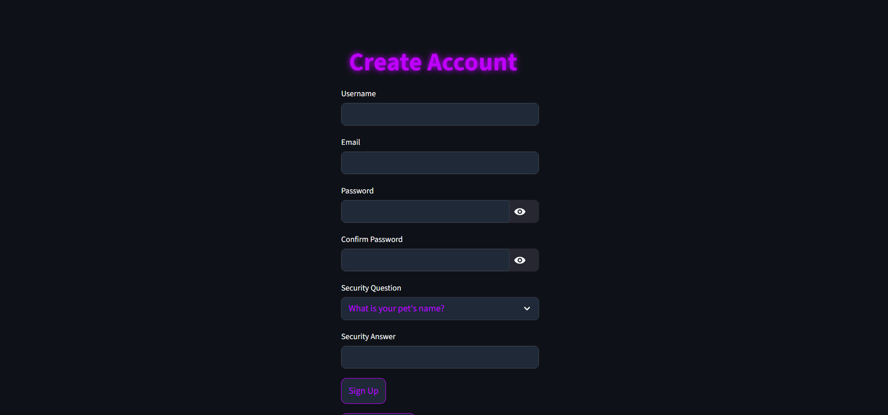
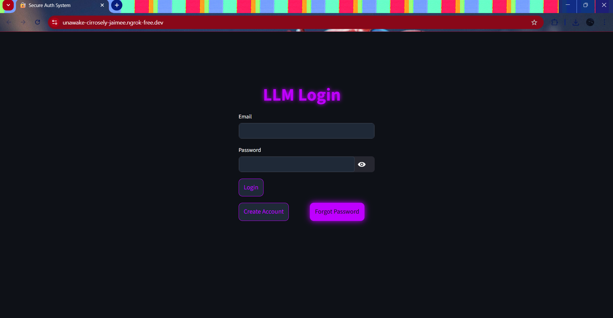

# Milestone 2 – AI Text Processing Application

## Features Implemented
- OTP Based Authentication
- Account Lock Mechanism
- Password History Restriction
- Readability Dashboard

## Readability Metrics Used
- Flesch Reading Ease
- Flesch Kincaid Grade
- Gunning Fog Index
- SMOG Index

## Tech Stack
- Python
- Streamlit
- SQLite
- NLP Models
- Textstat

## Screenshots
### Signup Page

### Login Page

### Dashboard

### Forgot Password

