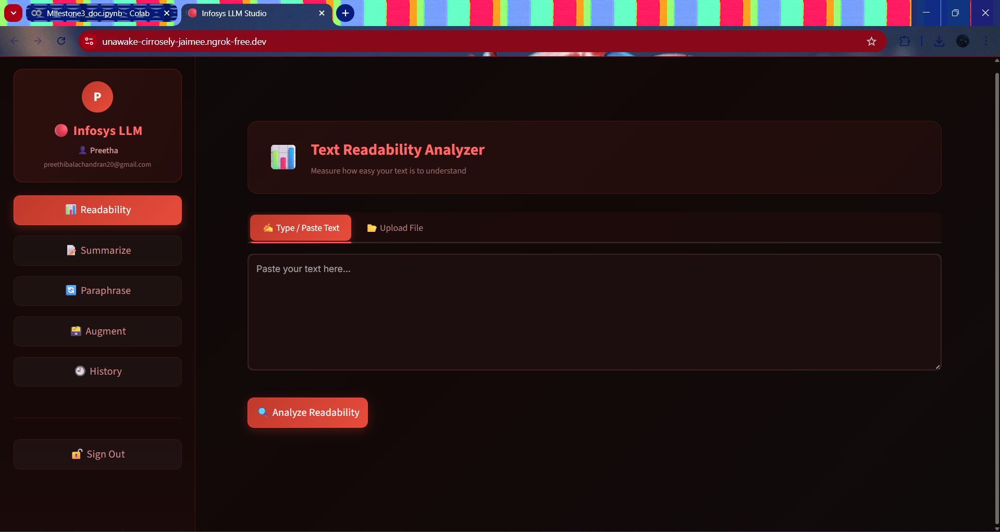
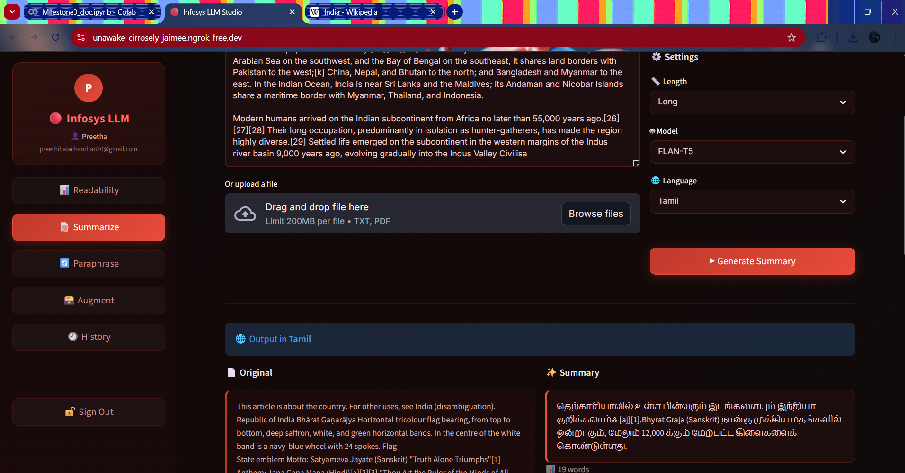
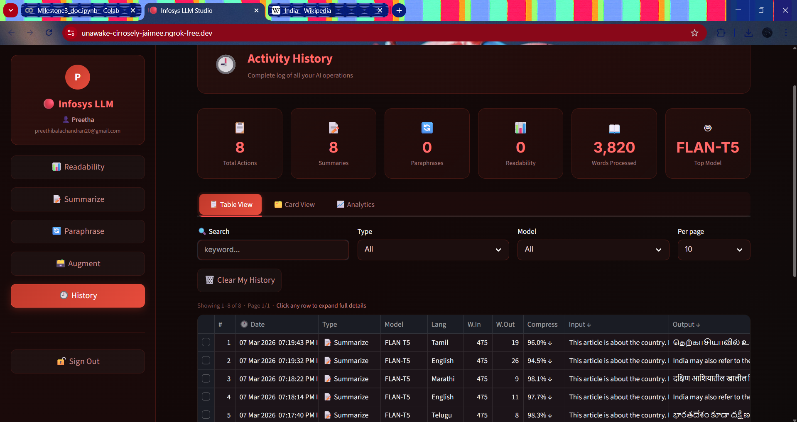

# Milestone 3

## Project Overview

This project is a secure AI-powered text processing platform that combines Natural Language Processing (NLP) models with a secure authentication system.
The application allows users to analyze text readability, generate summaries, paraphrase content, and interact with an AI-powered interface through a web dashboard.

The system integrates transformer-based language models, dataset augmentation techniques, and model fine-tuning to improve the accuracy and performance of text processing tasks.
---

# Features Implemented

## 1. Secure Authentication System

The platform includes a secure authentication mechanism to protect user accounts.

Features include:

* User registration and login
* Password hashing using bcrypt
* JWT token-based authentication
* Email-based OTP verification
* Password reset using security questions
* Login rate limiting to prevent brute-force attacks
* Password history protection to prevent reuse

---

## 2. Advanced Text Summarizer

The system provides an AI-based summarization tool capable of generating concise summaries from long text.

Capabilities:

* Handles large text inputs
* Works with TXT and PDF files
* Generates concise summaries automatically
* Integrated with readability analysis

Model used:

* BART
* PEGASUS
* T5

These transformer models are designed for high-quality text summarization tasks.

---

## 3. Paraphrase Engine

The paraphrase engine rewrites sentences while preserving their original meaning.

Key benefits:

* Improves readability
* Generates alternate sentence structures
* Helps avoid plagiarism

Model used:

* T5 Transformer model

The T5 model treats NLP tasks as a text-to-text problem, making it suitable for paraphrasing tasks.

---

## 4. Dataset Augmentation

To improve the training dataset, multiple text augmentation techniques were applied.

Techniques used:

* Synonym replacement
* Random word deletion
* Sentence shuffling
* Paraphrasing-based augmentation

These methods increase dataset diversity and help improve model generalization.

---

## 5. Model Fine-Tuning

The transformer models were fine-tuned on the project dataset to improve task performance.

Optimization techniques applied:

* 4-bit / 8-bit model quantization
* Efficient training pipeline
* Reduced memory usage

Benefits:

* Faster inference speed
* Reduced computational requirements
* Improved summarization quality

---

## 6. Readability Dashboard

The application includes a readability analyzer that evaluates the complexity of text.

Metrics included:

* Flesch Reading Ease
* Flesch-Kincaid Grade Level
* SMOG Index
* Gunning Fog Index
* Coleman-Liau Index

Additional statistics displayed:

* Sentence count
* Word count
* Syllable count
* Character count
* Complex word count

Results are visualized using interactive charts.

---

## 7. Improved User Interface

The user interface was enhanced to provide a modern and user-friendly experience.

UI improvements:

* Dark themed dashboard
* Sidebar navigation
* Interactive charts
* Clean layout and typography
* Structured navigation between modules

---

# System Architecture

User Interface (Streamlit)
↓
Authentication Layer (JWT + OTP)
↓
AI Processing Layer

* Summarizer
* Paraphrase Engine
* Readability Analyzer
  ↓
  Database (PostgreSQL)
* History
---

# Technologies Used

Backend

* Python
* PostgreSQL
* JWT Authentication
* bcrypt

AI / NLP

* Transformers
* PyTorch
* NLTK
* Dataset Augmentation Techniques

Frontend

* Streamlit
* Plotly
* Custom CSS styling

# Screenshots

### Login Page

### Readability Dashboard

### Summarizer

### Augmnet

### History

# Conclusion

This project demonstrates the integration of **secure authentication systems with advanced natural language processing techniques**.
By combining summarization, paraphrasing, readability analysis, and dataset augmentation, the platform provides a complete AI-based text processing solution.

The system highlights secure backend architecture, efficient AI models, and a modern user interface suitable for real-world applications.

